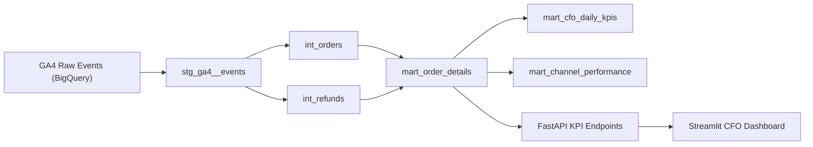

# CFO Panel

A finance-focused analytics engineering project that turns raw ecommerce event data into CFO-ready KPI tables, API endpoints, and an interactive dashboard.

This repository demonstrates how to take event-level Google Analytics 4 ecommerce data from BigQuery, model it with `dbt`, expose it through `FastAPI`, and present it in a `Streamlit` interface designed for executive reporting and portfolio storytelling.

## Why This Project Exists

Most ecommerce demo projects stop at charts. This one is designed to look and behave like a real analytics product:

- It models data in a layered `staging -> intermediate -> mart` structure.
- It shows the transformation path from raw events to executive KPIs.
- It exposes business metrics through an API, not only through SQL models.
- It includes a working dashboard so non-technical viewers can understand the outcome.
- It supports both sample-mode exploration and real BigQuery-backed execution.

If you are reviewing this repo on GitHub, the goal is to make the answer to these questions obvious:

- What raw data comes in?
- How is it transformed?
- Which business rules are applied?
- What tables and metrics does the CFO finally consume?

## What The Project Delivers

The current version is built around five outputs:

1. Raw-event ingestion assumptions based on the GA4 BigQuery ecommerce demo dataset
2. `dbt` models that create order-level and KPI-ready finance tables
3. A `FastAPI` backend that serves dashboard-friendly endpoints
4. A `Streamlit` frontend that visualizes both KPIs and the data journey
5. Environment-driven configuration so the app can switch from sample data to real BigQuery data

## Business Questions It Answers

This project is meant to answer practical finance and revenue questions such as:

- What is total net revenue over time?
- What is the refund rate?
- What is average order value?
- Which acquisition channels generate the most revenue?
- Which day was the strongest?
- How does raw event data become a CFO-facing KPI table?

## Core Metrics

The dashboard and marts currently focus on these metrics:

- `gross_revenue_usd`
- `refund_amount_usd`
- `net_revenue_usd`
- `gross_margin_usd`
- `refund_rate`
- `aov_usd`
- `order_count`
- channel-level revenue performance

Gross margin is currently modeled with an assumed COGS ratio. That makes the project useful for portfolio presentation today while leaving room for future integration with true product cost data.

## Data Source

Primary source:

- `bigquery-public-data.ga4_obfuscated_sample_ecommerce.events_*`

Official references:

- [GA4 BigQuery ecommerce demo dataset](https://developers.google.com/analytics/bigquery/web-ecommerce-demo-dataset)
- [GA4 BigQuery export schema](https://support.google.com/analytics/answer/7029846)

## Architecture



## Transformation Layers

### 1. Staging

The staging layer standardizes raw GA4 event fields into analytics-friendly columns.

Example responsibilities:

- parse `event_date`
- extract `order_id`
- map `purchase_revenue_usd`
- map `refund_value_usd`
- expose source / medium / campaign fields

Key model:

- [models/staging/stg_ga4__events.sql](models/staging/stg_ga4__events.sql)

### 2. Intermediate

The intermediate layer applies business logic and aggregation rules.

Current models:

- [models/intermediate/int_orders.sql](models/intermediate/int_orders.sql)
- [models/intermediate/int_refunds.sql](models/intermediate/int_refunds.sql)

This is where purchase and refund logic starts to become reusable business data.

### 3. Marts

The mart layer is where the CFO-facing output is created.

Current marts:

- [models/marts/mart_order_details.sql](models/marts/mart_order_details.sql)
- [models/marts/mart_cfo_daily_kpis.sql](models/marts/mart_cfo_daily_kpis.sql)
- [models/marts/mart_channel_performance.sql](models/marts/mart_channel_performance.sql)

## Product Experience

The app does more than display metrics. It also explains the system.

### Dashboard

The Streamlit UI includes:

- KPI cards for revenue, margin, refund rate, AOV, orders, and channel count
- a daily net revenue trend chart
- a channel revenue mix chart
- tables for daily KPIs, channel performance, and recent orders

### Data Journey View

One of the most important parts of the project is the data journey section. It shows:

- raw source events
- the cleaned staging representation
- the order-level model
- the final mart preview

This makes the repo easier to understand for recruiters, hiring managers, and stakeholders who are not going to open SQL files first.

## API Layer

The FastAPI app exposes dashboard-ready endpoints:

- `GET /health`
- `GET /api/v1/dashboard`
- `GET /api/v1/data-journey`
- `GET /api/v1/overview`
- `GET /api/v1/channel-performance`
- `GET /api/v1/recent-orders`

Main API entrypoint:

- [src/cfo_panel/api/app.py](src/cfo_panel/api/app.py)

## Real Data Strategy

The application follows this runtime strategy:

1. Try to read from the dbt mart table `mart_order_details`
2. If marts are not available, try to derive the same order-level data directly from the raw GA4 BigQuery source
3. If BigQuery credentials are not configured, fall back to embedded sample data so the UI still works

This makes the project useful in both portfolio mode and real integration mode.

## Repository Structure

```text
.
├── .env.example
├── dbt_project.yml
├── models/
│   ├── staging/
│   ├── intermediate/
│   └── marts/
├── profiles/
│   └── profiles.yml.example
├── src/
│   └── cfo_panel/
│       ├── api/
│       ├── frontend/
│       ├── services/
│       └── settings.py
├── streamlit_app.py
├── tests/
└── pyproject.toml
```

## Local Setup

### 1. Create a virtual environment

```bash
python3 -m venv .venv
source .venv/bin/activate
```

### 2. Install dependencies

```bash
pip install -e .
```

### 3. Configure dbt

Copy the profile template:

```bash
mkdir -p ~/.dbt
cp profiles/profiles.yml.example ~/.dbt/profiles.yml
```

Then update the values in `~/.dbt/profiles.yml`:

- set your GCP project
- set your target dataset
- keep `location: US` for the public GA4 demo dataset

Template:

- [profiles/profiles.yml.example](profiles/profiles.yml.example)

### 4. Configure environment variables

Create a local `.env` file:

```bash
cp .env.example .env
```

You can either edit `.env` manually or use the `GCP / BigQuery Settings` panel in the Streamlit sidebar.

Important values:

- `CFO_PANEL_BIGQUERY_PROJECT`
- `CFO_PANEL_MART_PROJECT`
- `CFO_PANEL_MART_DATASET`
- `CFO_PANEL_BIGQUERY_LOCATION`
- `GOOGLE_APPLICATION_CREDENTIALS`

Template:

- [.env.example](.env.example)

## Build The dbt Models

Run the full finance path:

```bash
dbt debug
dbt run --select int_orders int_refunds mart_order_details mart_cfo_daily_kpis mart_channel_performance
dbt test
```

## Run The Backend

```bash
source .venv/bin/activate
set -a; source .env; set +a
uvicorn --app-dir src cfo_panel.api.app:app --reload
```

## Run The Frontend

```bash
source .venv/bin/activate
set -a; source .env; set +a
streamlit run streamlit_app.py
```

## Testing

Run the local test suite:

```bash
python -m unittest discover -s tests
python -m compileall src tests streamlit_app.py
```

Current tests cover:

- dashboard payload structure
- repository fallback behavior
- channel filtering logic
- `.env` settings read/write round trips

## Key Files To Review

If you want to understand the project quickly, start here:

- [README.md](README.md)
- [dbt_project.yml](dbt_project.yml)
- [src/cfo_panel/services/dashboard_service.py](src/cfo_panel/services/dashboard_service.py)
- [src/cfo_panel/services/bigquery_repository.py](src/cfo_panel/services/bigquery_repository.py)
- [src/cfo_panel/frontend/app.py](src/cfo_panel/frontend/app.py)

## Current Limitations

This project is already strong as a portfolio artifact, but it still has room to grow:

- gross margin uses an assumed COGS ratio
- payment success logic is not modeled yet
- cancellation logic is not modeled yet
- customer-level marts are not modeled yet
- automated deployment is not included yet

## Roadmap

Planned next steps:

- integrate real payment provider data
- model cancellations and order state transitions
- add customer and cohort marts
- replace proxy COGS with product-level cost data
- add CI checks for dbt tests and app validation
- deploy the dashboard as a shareable demo environment

## What Makes This Repo Stand Out

This project is intentionally built to be review-friendly.

Instead of only saying "I can build dashboards", it demonstrates:

- analytics engineering structure
- business-facing metric design
- API product thinking
- UI communication for non-technical stakeholders
- explainability from source data to executive KPI

That combination is what turns a simple demo into a believable data product.
